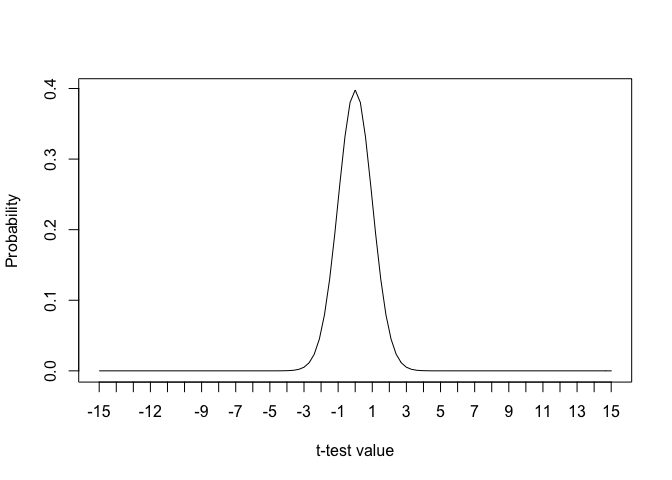
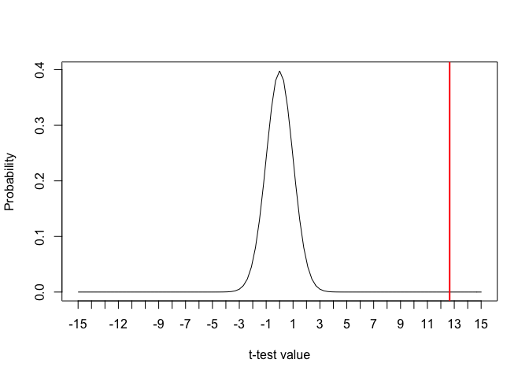
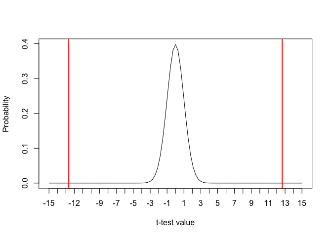

Module 2, Lab 2: *p*-values
===========================

In this lab, we will explore how the basics of null hypothesis
significance testing work. Although you may have examined this in a
previous course, we will review the concepts of *p*-values and tests of
statistical significance with an emphasis on their application in
research.

The Null Hypothesis
===================

First, we briefly review what the null hypothesis is. Recall from the
previous lab that the results that come from samples are only mere
estimates of the population. Because they are estimates, the statistics
they produce will differ somewhat from their population counterparts.
For example, the correlation between engagement in a sample may be *r* =
.2 even when the correlation between those same variables in the
population is something smaller, such as .10 or even 0. This can cause
apparent relationships and effects to appear in *samples* when none in
fact exists in the population. This idea--that the effect/association is
*zero* in the population--is called the null hypothesis. By implication,
any effect/association seen in the *sample* must be entirely due to the
random chance of "sampling error." In other words, the null hypothesis
claims that the sample result is a random fluke.

Let's explore an application of this. Imagine we want to compare males
and females in terms of their interest in a given product. Imagine, for
a moment, that *the two groups have identical interest* (in the
population)...that is, there is no difference between the groups.
Nevertheless, if we take a sample of males and a sample of females, the
error in our estimations will cause a difference to appear.

Imagine that *both* males and females had an interest level averaging at
5, with a standard deviation of 3.

    # set seed to make random number generation reproducible
    set.seed(51423)

    #collect a sample of 100 males
    males <- rnorm(100, 5, 3)

    #collect a sample of 100 females
    females <- rnorm(100, 5, 3 )

    mean(males)

    ## [1] 4.520818

    mean(females)

    ## [1] 5.275667

We see here that our two groups have different sample results. Let's see
how large the difference is:

    mean(females)-mean(males)

    ## [1] 0.7548484

We see here that the females are almost 3/4 of a point higher than the
males. If you saw this data in an organization where you were working,
you might be tempted to think you'd discovered a female preference for
your product. However, in fact, we *know* in this case that this is
nonsense as we *know* (because we wrote the R code simulating this data)
that *both* groups were random samples from a population with a mean of
5 and a standard deviation of 3. If their means are both 5.0 (exactly)
in the population, why did the females score higher in the samples? It's
simple: sampling error. That is, the difference is **entirely** due to
random error in the samples, not any real difference in the population.
We have discovered a fluke in some sample data, nothing more.

This is a case of the "null hypothesis." In this case, the means are
*equal* in the population. We write the null hypothesis as
*H*0 and it is always a statement that the size of the effect
in the population is zero. In this case, we are testing the difference
between the averages (*μ*′*s*), stating that the *difference between
them is zero*:

*H*0 : *μ**m**a**l**e* − *μ**f**e**m**a**l**e* = 0

However, to reiterate what we saw above, *when we looked at our
samples,* we saw there was a difference:

    mean(females)-mean(males)

    ## [1] 0.7548484

So, in conclusion, the null hypothesis says that whatever effect you are
studying is *zero* in the population and *your sample results are due to
random chance.*

This possibility looms ominously over every research finding based on
samples data. How do we know that the effects we trust every day (the
effect of medicine, tested leadership practices, etc.) are real and not
just flukes due to random sampling error? We need to find a way to test
the null hypothesis and see if we can reject this possibility.

Null Hypothesis Significance Test: The *p*-Value
================================================

To test the null hypothesis, we simply ask: *if the null hypothesis were
true, what percentage of the time would I get this result this large?*
The answer to that question is called a *p*-value.

There is a lot of confusion about *p*-values, so let's review:

-   *p*-values represent how often you could get a result as big as you
    did *if the null were true*
-   *p*-values therefore represent how easy/hard it would be to get a
    result by chance
-   *p*-values do **not** tell you the probability that the result is
    due to chance; only the probability of seeing *your result* if the
    null were true
-   If the *p*-value for a result is small, it would be rare to get that
    result by chance (i.e., if the null were true)
-   If the *p*-value for a result is large, it would be common to get
    that result by chance (i.e., if the null were true)
-   Conclusion: the *p*-value is a measure of "incompatibility" between
    your result and the null. If the *p*-value is small, one of the two
    (the data, or the null) is likely wrong. We opt to trust our data
    and reject the null.

To be clear: the *p*-value is a backwards way of testing the null
hypothesis. We would love to know the *probability* that the null
hypothesis is true--the probability that the results *are* due to
chance--but we cannot know that. You will often hear the *p*-value
described this way, but that is **very wrong**.

So, to repeat, the *p-value states the probability of getting **your
result** if the null is true*. It is essentially a statement of
incompatibility between your data and the null. A small *p*-value
(typically, less than 5% or "&lt; . 05") tells you that the data and
null are highly incompatible. Since you did in fact observe the data,
you conclude the null hypothesis is false. This is the only use for the
*p*-value.

Where do *p*-Values Come From?
==============================

Where does a *p*-value come from? Every data situation is different, but
the process in so-called "frequentist" statistics is always the same""

1.  Observe data and examine result
2.  Compute the appropriate "test statistic" for that result (e.g., *t*
    test, *z* test, *χ*2 test, *F* test, *q* test etc.).
3.  Observe how often you could get the observed test statistic if the
    null hypothesis was true. This is the *p*-value
4.  If the *p*-value is less than .05, declare the result "significant"
    and reject the null hypothesis

Let's see this in action. For this example, I will use a "one-sample
*t*-test", as the math is easier.

Imagine we assess people's impressions of a training given in an
organization. We assess attitudes toward the training on a -5 (very
negative) to +5 (very positive) scale (zero = neutral opinion).

The question is whether people have a positive or negative attitude
toward the training, on average. Let's imagine that they actually have a
positive attitude, that in the population the mean is really 2.4 (i.e.,
*μ* = 2.4) with a standard deviation of 2.0. This is a simulated example
(in real life, you would have no idea what the population value is:
that's why you're doing research). Still, by showing you a simulated
example, we can see how the procedure works.

What would the null hypothesis be, here? Well, the null hypothesis
always states that the effect is absent. In this case, an "effect" would
be a non-zero attitude. Thus, in this case, *H*0 : *μ* = 0.

Let's pull a random sample of 100 scores from that population.

    attitude <- rnorm(100, 2.4, 2.0)

What are the mean and SD in our sample?

    mean(attitude)

    ## [1] 2.293718

    sd(attitude)

    ## [1] 1.812142

So, our null hypothesis is that the mean is zero
(*H*0 : *μ* = 0) but our sample result disagrees with that
(sample mean = 2.29).

Does this *sample* gives us enough evidence to reject the null?

To answer that question, we calculate a test statistic. In this case
(one group, sample mean), we conduct a one-group *t*-test for means. (As
you progress in your data science and statistics knowledge, you will
learn when to use different kinds of tests.)

In the *t*-test, we compare the size of the difference between our
observed result and the null hypothesis, divided by what you would
typically expect by chance (i.e., standard error):

$$t=\\frac{result - null }{chance}$$

Since our sample result is a sample mean ($\\bar{x}$), and we know the
equation for the standard error for a sample mean (mentioned at the end
of the previous lab: $\\frac{SD}{\\sqrt{n}}$ ), we can re-write the
*t*-test as follows:

$$t = \\frac{\\bar{x}-H\_0}{\\frac{SD}{\\sqrt{n}}}$$

We can plug in our numbers easily:

$$t = \\frac{\\bar{x}-H\_0}{\\frac{SD}{\\sqrt{n}}} =  \\frac{2.294-0}{\\frac{1.812}{\\sqrt{100}}} = 12.657$$
 The test assesses how much the data disagree with the null (i.e., the
effect; top of fraction) compared to what you would typically expect by
chance (bottom of fraction). Thus, we can literally read the result as
saying "our effect was 12.657 times greater than you would typically
expect by chance." That sounds pretty good for our effect and pretty bad
for the null hypothesis.

It is convenient that the *t*-test works this way. However, truth be
told, the test statistic need not have *any* intuitive meaning. To get
our *p*-value, the only thing we need to do is assess how rare our
result would be if the null hypothesis was true. Thus, it doesn't really
matter if we can interpret the *p*-value directly. We simply need to
know where *t*-test results tend to be when the null is true, and then
we can see how rare a score of 12.657 would be in that situation, giving
us our *p*-value.

This is an easy question to answer. Statisticians have mapped out the
exact behavior of each test statistic when the null hypothesis is true
(or as we often say, "under the null"). We know, for example, that if
the null hypothesis is true, that the *t*-test will be close to zero
(almost always within $$3 points of zero). So, what is our *p*-value? If
the null were true, how often could we get *t*-test result as big as
12.657?

Using R
=======

R will do all of it for you in one line of code:

    t.test(attitude, mu=0)

    ## 
    ##  One Sample t-test
    ## 
    ## data:  attitude
    ## t = 12.657, df = 99, p-value < 2.2e-16
    ## alternative hypothesis: true mean is not equal to 0
    ## 95 percent confidence interval:
    ##  1.934150 2.653286
    ## sample estimates:
    ## mean of x 
    ##  2.293718

The key information is given to you in the top line:
`t = 12.657, df = 99, p-value < 2.2e-16`. Notice that R is giving you
the *p*-value in scientific notation. `2.2e-16` is scientific notation:
2.2 x 10-16 and means the same as 0.00000000000000022. This
is clearly less than .05 so we can reject the null hypothesis and
conclude that the positive attitude observed among our participants was
not a statistical fluke but likely a real trend in the population.

(In reality, the *p*-value is smaller than this, but this is the
smallest value that the R code will give you in a hypothesis test due to
limitations in the code.)

### For Illustration Purposes

How did R find that *p*-value? I will illustrate.

I start with a plot of all the *t*-test results (for sample size of 100)
you would expect **if the null hypothesis was true.** We know this,
thanks to mathematicians.

The bell curve above illustrates all the possible *t*-test results one
would expect when the null is true and their respective probabilities.
We see here that most results are within about +/- 3 points from zero.
Where is our result? Let's add it to the plot.

As we see, our result is out among values that are very, very rare under
the null hypothesis. It appears that our data disagree the null
hypothesis. When the null is true, we should be getting *t*-test results
down in the center of the bell curve (approximately ± 3), but we didn't.
We were up at 12.657.

To find the *p*-value, we simply ask what percentage of our *t*-curve is
out that far. In other words, what proportion of the bell curve extends
out beyond the red line? What is the area "in the upper tail"?

We can easily ask R that question with the following code:
`1-pt(abs(YOUR.t.SCORE), df=SAMPLE.SIZE.MINUS.1)`. Note that I need to
tell R our "degrees of freedom," which for this test is
*n* − 1 = 100 − 1 = 99:

    1-pt(abs(12.657), df=99)

    ## [1] 0

R is saying there is "zero" probability of getting a result this big if
the null were true; i.e., *p* = 0. In reality, *p* values are never zero
but can get infinitely small. R is essentially giving up when trying to
calculate it.

This is called a on-tailed *p*-value. We actually, however, need to
double it. The reason we need to double it is that our null hypothesis
was that *μ* = 0. That is, the null is false if our result is
significantly *larger* than zero (a positive attitude) or significantly
*smaller* than zero (a negative attitude). This is consistent with how
we asked our question: "do people have positive or negative attitudes?"
In other words, we did not test a directional prediction; we would be
interested in "finding" something regardless of the direction of the
effect. Since the *p*-value is the probability of getting an effect
"this large" and we do not care about the direction, it actually exists
on both sides of the distribution (a negative attitude would have given
us a negative *t*-score):

Thus, we have to double our *p*-value. This is standard practice any
time you would be willing to declare the result significant **regardless
of the direction**. We call this a *two-tailed p-value*.

If this explanation is confusing, you can also understand it a slightly
different way: by testing *H*0 : *μ* = 0, you are really
asking whether *μ* &lt; 0 or whether *μ* &gt; 0. You are essentially
asking two separate questions of the data. You need to double your
*p*-value.

This is almost always what you want. We almost always want to be able to
declare a result significant if the effect is large, regardless of
whether the direction of the result matches our intuition or not. For
example, if an intervention to increase productivity backfires and
decreases productivity, we want to know that just as much as we want to
know if it works.

Thus, we almost always double the *p*-value for this reason. It is true
that it makes it a little harder to get a significant result (less than
.05), but we can extract more meaning from the result. It's worth it.

Note: our doubled *p*-value here is still essentially zero:

    2*(1-pt(abs(12.657), df=99))

    ## [1] 0

R will report this by default, unless you ask the `t.test()` command
otherwise.
