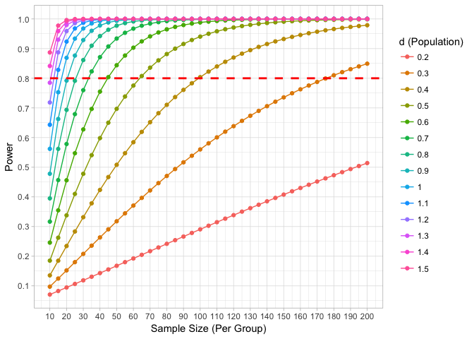
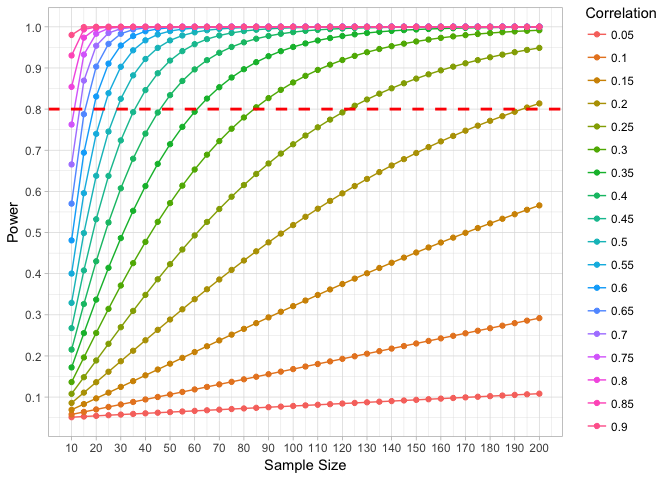

Module 2, Lab 4 - Power 1
=========================

In this lab, we explore the concept of statistical power. Recall that
power is the ability to reject the null hypothesis. Greater power means
greater ability to reject the null hypothesis. Of course, if you cannot
reject the null hypothesis, you cannot rule out random chance as an
explanation for your findings. Therefore, the ability to reject the null
hypothesis should be considered a bare minimum for any research or data
science finding that relies on samples to estimate populations. In fact,
as we saw in the confidence interval lab, it's often desirable to be
even more precise than rejecting the null hypothesis (i.e., more precise
than "effect is not zero"). Still, good power is a bare minimum
requirement.

Note: you will need the `effsize` package for this lab to measure effect
sizes; you will also need the `pwr` package. We will do some data
visualization with `ggplot2` as well:

    ### LOAD PACKAGES ####
    library(pwr)
    library(effsize)
    library(ggplot2)

Note that for this lab you need to be familiar with the effect size
statistic, Cohen's *d*, discussed in the online lesson. I will assume
you have watched this and are familiar with how *p*-values work to
reject the null hypothesis. If you need to refresh these concepts, do so
before completing this lab. The standard guidelines for Cohen's *d* are:

    ##           d    meaning
    ## 1   0 - 0.2 Negligible
    ## 2 0.2 - 0.5      Small
    ## 3 0.5 - 0.8     Medium
    ## 4   0.80 +       Large

Power Overview
==============

Technically defined, power is the proportion of the time in which you
would achieve *p* &lt; .05 for a given population effect size. Power is
relevant *only* when the null hypothesis is false. Assuming that the
null is false, what is the likelihood that your study will actually
detect the effect that is truly present? For example, a study that has
only 20% power has only a 20% chance to actually detect the effect that
is present (i.e., achieve statistical significance, *p* &lt; .05).
Clearly, you do not want your study to be set up to fail. You want good
power...usually the recommendation is .80 or higher.

Power is **highly dependnet on sample size**.

For example, imagine that, in the population, the size of the difference
between two groups (e.g., "intervention group to increase productivity"
vs. "business as usual" group) was *d* = .4. A study with *n*= 40 people
per group would only have 42% power, i.e., be able to reject the null
hypothesis 42% of the time.

How do I know that? I used a power calculator.

This can be easily calculated using the `pwr.t.test()` command in the
`pwr` package in R. This package contains a family of related commands
for many different kinds of analyses.

     pwr.t.test(n=40, d=.4)

    ## 
    ##      Two-sample t test power calculation 
    ## 
    ##               n = 40
    ##               d = 0.4
    ##       sig.level = 0.05
    ##           power = 0.4235212
    ##     alternative = two.sided
    ## 
    ## NOTE: n is number in *each* group

We see here that the power is given as `power = 0.4235212`.

Power is a function of both the effect size and the sample size. Imagine
that we had a larger sample, say *n* = 100 people per group. Would our
power improve?

     pwr.t.test(n=100, d=.4)

    ## 
    ##      Two-sample t test power calculation 
    ## 
    ##               n = 100
    ##               d = 0.4
    ##       sig.level = 0.05
    ##           power = 0.8036475
    ##     alternative = two.sided
    ## 
    ## NOTE: n is number in *each* group

Indeed, now we have reached 80% power, the standard guideline for
acceptable power.

We could see what happens if we use larger groups, say 150 per group:

     pwr.t.test(n=150, d=.4)

    ## 
    ##      Two-sample t test power calculation 
    ## 
    ##               n = 150
    ##               d = 0.4
    ##       sig.level = 0.05
    ##           power = 0.9322752
    ##     alternative = two.sided
    ## 
    ## NOTE: n is number in *each* group

Now we have 93% power. You always want high power. If power is low, you
risk missing real effects, spending time and energy on a study coming up
empty even when there is something to be found.

To reiterate, in power calculations, there are always three things that
interrelate:

1.  Power
2.  Sample size (*n* per group in group-comparison studies)
3.  Effect size

In most power calculators, you enter any two of those three, and the
third can be determined for you.

For example, say we are planning a study and want to know how many
responses are required. We can specify the desired power (leave `n`
blank) and the command will find the required sample size:

     pwr.t.test(power=.80, d=.4)

    ## 
    ##      Two-sample t test power calculation 
    ## 
    ##               n = 99.08032
    ##               d = 0.4
    ##       sig.level = 0.05
    ##           power = 0.8
    ##     alternative = two.sided
    ## 
    ## NOTE: n is number in *each* group

We see here that this study would require 100 people per group (best to
round up).

However, the relationship between sample size and power is not fixed. In
fact, power also goes down as effect size goes down. This should make
sense: it is much harder to detect a very tiny effect than it is a very
large effect. Let's re-run the last command, asking how many people are
needed for 80% power but now considering the situation where the
population *d* is smaller, *d* = .20:

     pwr.t.test(power=.80, d=.2)

    ## 
    ##      Two-sample t test power calculation 
    ## 
    ##               n = 393.4057
    ##               d = 0.2
    ##       sig.level = 0.05
    ##           power = 0.8
    ##     alternative = two.sided
    ## 
    ## NOTE: n is number in *each* group

We see now that our required sample size has jumped to 394 per group, a
much larger and more expensive study.

So, as you plan studies, you need to tell a power calculator the desired
power level (recommended: 80% or .80) *and* the population effect size.

**However, you don't know the population effect size. If you did, you
wouldn't be running a research study, would you?**

Standard practice, therefore, is to input the smallest effect size you
would care to be able to detect (called "smallest effect size of
interest, or SESOI).

For example, perhaps your research question is *very important* and you
want to be able to detect any effect, even if it is small. In that case,
power the study as above with 394 people per group.

Or, perhaps a small effect is unimportant to you; you care to know if an
effect is present but really only if it's large (you're fine getting a
null result if the effect is small; small effects are not important to
you). In that case, you can use a more lenient criteria:

     pwr.t.test(power=.80, d=.8)

    ## 
    ##      Two-sample t test power calculation 
    ## 
    ##               n = 25.52458
    ##               d = 0.8
    ##       sig.level = 0.05
    ##           power = 0.8
    ##     alternative = two.sided
    ## 
    ## NOTE: n is number in *each* group

This example would let us have 80% power to detect a large effect with
only 26 people per group. However, the high power is only present when
the effect is that large. if the effect were smaller, your power would
be worse and you would likely miss it. Let's take that same sample size
and consider what would happen if your effects were smaller than *d* =
.80. Try running the command for *n* = 26 and *d* = .30. What is the
power?

    pwr.t.test(n=26, d=.30)

    ## 
    ##      Two-sample t test power calculation 
    ## 
    ##               n = 26
    ##               d = 0.3
    ##       sig.level = 0.05
    ##           power = 0.1855886
    ##     alternative = two.sided
    ## 
    ## NOTE: n is number in *each* group

Yikes! For that 26-person-per-group study, if the population effect size
were *d* = .30, we would have only an 18% chance of detecting the
effect. Thus, the *same* study can have very good power to detect large
effects but terrible power to detect small effects. Thus, the researcher
should always decide the smallest effect size of interest and power the
study to detect that.

Just to play with this some more, let's illustrate how a sample size of
26 per group performs across a variety of effect sizes. I will use a
loop command to do this.

    #create empty container to store  power results
    power <- NULL

    #create sequence of d values to test, from .10 to 1.5 in increments of .10
    d.values <- seq(from=.10, to = 1.5, by=.10)

    # There are 15 d values, so we will need to run a loop 15 times
    # For each d value, run the power function and save the power resul
    for (i in 1:15){
      power[i] <-  pwr.t.test(26, d=d.values[i])$power
    }

    #bind results together into comuns to make a table
    cbind(d.values, power)

    ##       d.values      power
    ##  [1,]      0.1 0.06444943
    ##  [2,]      0.2 0.10899469
    ##  [3,]      0.3 0.18558861
    ##  [4,]      0.4 0.29311109
    ##  [5,]      0.5 0.42403437
    ##  [6,]      0.6 0.56425214
    ##  [7,]      0.7 0.69679845
    ##  [8,]      0.8 0.80748662
    ##  [9,]      0.9 0.88916593
    ## [10,]      1.0 0.94243028
    ## [11,]      1.1 0.97312701
    ## [12,]      1.2 0.98876176
    ## [13,]      1.3 0.99579964
    ## [14,]      1.4 0.99859963
    ## [15,]      1.5 0.99958418

Using that sample size of 26, we see that we have excellent power to
detect large effect sizes (Cohen *d* values .80 and above), but we would
have very low power (very likely to get a non-significant result) if the
effect is small. In such cases, we would likely come back and say "we
did not find a difference" when really we simply missed what was there.

Thus, you must always decide the smallest effect size you want to be
able to have good power to detect. This should be based on the
importance of the question, resources available, and how big you guess
the effect might be. If you are chasing very nuanced things in noisy
data, you may need very large samples to get statistical significance.

Planning Sample Size
====================

Sometimes it can be handy to generate a number of power estimates for
different effect sizes and sample sizes. I use a loop to do this. In
this case, I create two nested loops. The first runs through a sequence
of effect sizes. The second runs a loop testing many samples sizes at
the current effect size. I assume you are familiar with programming
loops to run this code:

    #create empty containers to store  power results, sample size and effect size inputs. 
    power <- NULL
    size <- NULL
    pop.d <- NULL
    i <- 1

    # run two loops. The first runs through all the d values in the sequence from d=.20 to d=1.5 (increments of .10)
    # within that, it then tests every possible sample size from 10-200 increments of 5
    for(d in seq(from=.2, to=1.5, by=.10)){
      for(n in seq(from=10, to=200, by=05)){
        power[i] <- pwr.t.test(n=n, d=d, alternative="two.sided")$power
        size[i] <- n
        pop.d[i] <- d
        i <- i+1
      }
    }
    results <- data.frame(power, size, pop.d)

Next, we can produce a nice plot of this using `ggplot2`. I assume you
are familiar with `ggplot2` to run this code:

    ggplot(data=results, aes(x=size, y=power, color=factor(pop.d), group=pop.d))+
      geom_line()+
      geom_point()+
      geom_hline(color="red", linetype="dashed", size=1, aes(yintercept=.80))+
      theme_light()+
      scale_x_continuous(name="Sample Size (Per Group)",breaks=seq(10, 200, 10))+
      scale_y_continuous(name="Power", breaks=seq(0,1,by=.10))+
      scale_color_discrete(name="d (Population)")

(A full review of ggplot2 is outside the scope of this tutorial, but I
would encourage you to familiarize yourself with it. There are many
great web tutorials and books devoted to this fantastic visualization
tool.)

You can modify the above code for different sample sizes and ranges, but
the rest stays the same. You can easily see with the graph that 80%
power (red dashed line) would take 180 participants per group for a *d*
= .03 but would only take 45 people per group at *d* = .06.

Note that the `pwr` package has many different commands, including
commands that allow unequal group sizes, tests for correlations, and
many others.

For example, using `pwr.r.test()` we could make a similar graph for
correlations:

    power <- NULL 
    size <- NULL
    pop.r <- NULL
    i <- 1

    for(rho in seq(from=.05, to=.90, by=.05)){
      for(n in seq(from=10, to=200, by=05)){
        power[i] <- pwr.r.test(n=n, r=rho, alternative="two.sided")$power
        size[i] <- n
        pop.r[i] <- rho
        i <- i+1
      }
    }
    dat <- data.frame(power, size, pop.r)

    ggplot(data=dat, aes(x=size, y=power, color=factor(pop.r), group=pop.r))+
      geom_line()+
      geom_point()+
      geom_hline(color="red", linetype="dashed", size=1, aes(yintercept=.80))+
      theme_light()+
      scale_x_continuous(name="Sample Size",breaks=seq(10, 200, 10))+
      scale_y_continuous(name="Power", breaks=seq(0,1,by=.10))+
      scale_color_discrete(name="Correlation")

Data Already Collected. What Now?
=================================

Often a study is already collected, yet power may be unclear. What can
be done?

In this case, the appropriate tool is a "sensitivity analysis" in which
you enter the desired power (80%) and the sample size achieved. The
analysis will tell you your smallest effect size of interest.

Imagine a study was conducted comparing two groups,
*n*1 = 320 and *n*2 = 185. Fortunately,
`pwr.t2n.test()` can handle different samples sizes. This study was
already run, but we can enter two of the 3 power criteria (sample size,
power) and the third (effect size) can be determined for you.

    pwr.t2n.test(n1=320, n2=185, power=.80)

    ## 
    ##      t test power calculation 
    ## 
    ##              n1 = 320
    ##              n2 = 185
    ##               d = 0.2592499
    ##       sig.level = 0.05
    ##           power = 0.8
    ##     alternative = two.sided

This tells us that with our sample sizes and a desire for 80% power, we
can detect effects as small as *d* = .26. From our Cohen's *d* table,
this is considered a lower-end small effect. As long as the population
effects are that large (or larger), we should have adequate power.
However, I would be cautious about interpreting results smaller than
that from this sample.

Sensitivity Analysis for Correlation
====================================

For another example, say your organization wants to make the case that a
measure of customer sentiment is associated with the number of items
purchased by customers. There is a correlation reported in a sample of
50 responses. What is the power?

We can use `pwr.r.test()` for this purpose:

    pwr.r.test(n=50, power=.80)

    ## 
    ##      approximate correlation power calculation (arctangh transformation) 
    ## 
    ##               n = 50
    ##               r = 0.3843186
    ##       sig.level = 0.05
    ##           power = 0.8
    ##     alternative = two.sided

We have the ability to detect population correlations of .38 and larger.
If we think effects might reasonably be smaller than that, then this set
of data is of questionable value.

One Final Word of Caution
=========================

Some people have brushed aside the issue of poor power, especially when
a result is significant. After all, if a result is significant, it *had*
power to reject the null, right?

Wrong. Beware significant findings from under-powered studies.

Consider a study that has very low power. In such a case, the researcher
has almost *no* ability to find true effects.

However, false positives *still happen* 5% of the time (when the null is
true).

Thus, as power gets lower, the number of "true" positives (real effects,
discovered) goes down, while the number of false positives stays fixed.
When power is low, false positives can equal or even outnumber true
positives. In such cases, when an effect is significant, it is very
challenging to know whether the effect is a true positive or a false
positive. We will explore this issue in a future lesson, but take this
as a word of caution about under-powered studies.
