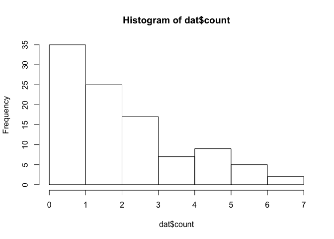
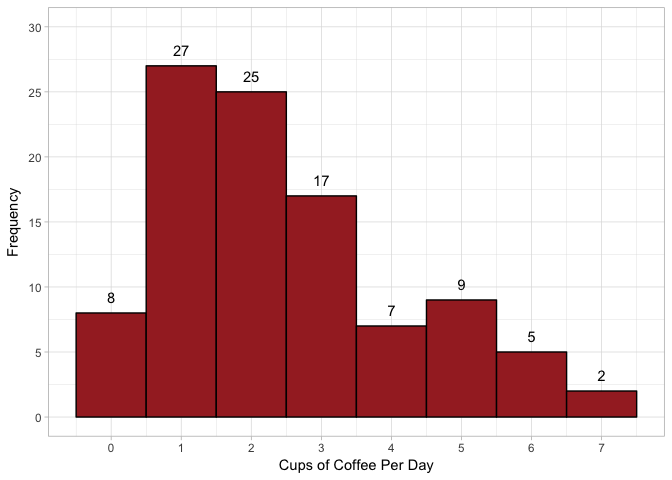

Module 3, Lab 1 - Frequency Claims
==================================

In this lab, we will examine how to analyze data for a frequency claim.
A frequency claim is where the level of a single variable is reported.

In this example, you are analyzing data from a local coffee company. You
wish to know how many coffee beverages are consumed by the average
customer in a day. These customers are surveyed and the data are
produced. You load the data from a CSV file (in the github folder for
this lab).

This lab will use the `Rmisc` package to make a confidence interval, the
`ggplot2` package for plotting, and the `psych` package to test skew.

    #### LOAD PACKAGES ####
    library(psych)
    library(ggplot2)

    ## 
    ## Attaching package: 'ggplot2'

    ## The following objects are masked from 'package:psych':
    ## 
    ##     %+%, alpha

    library(Rmisc)

    ## Loading required package: lattice

    ## Loading required package: plyr

Next, we load our data:

    #### LOAD DATA ####
    dat <- read.csv("cupsdat.csv")

You inspect the data:

    names(dat)

    ## [1] "X"     "count"

    head(dat)

    ##   X count
    ## 1 1     1
    ## 2 2     7
    ## 3 3     3
    ## 4 4     3
    ## 5 5     2
    ## 6 6     1

There is an ID variable `X` and a variable indicating the number of
beverages named `count`.

The first thing to do is to explore the variable. The `summary()`
function has many useful features.

    summary(dat$count)

    ##    Min. 1st Qu.  Median    Mean 3rd Qu.    Max. 
    ##    0.00    1.00    2.00    2.45    3.00    7.00

Here we see that scores range from 0-7, with a median of 2.

Exploring Counts
================

We can also view a `table()` of results:

    table(dat$count)

    ## 
    ##  0  1  2  3  4  5  6  7 
    ##  8 27 25 17  7  9  5  2

This gives us a sense of the distribution. I actually prefer the
`as.matrix()` version of `table()`

    as.matrix(table(dat$count))

    ##   [,1]
    ## 0    8
    ## 1   27
    ## 2   25
    ## 3   17
    ## 4    7
    ## 5    9
    ## 6    5
    ## 7    2

We see the possible values of `count` on the left and the observed
number of each on the right. Clearly, the most common scores are 1 and 2
beverages, which makes sense.

Often, stakeholders want percentages. This is easy to accomplish,
provided you know how many responses you have. The number of rows in the
dataset can be returned with `nrow(dat)`:

    nrow(dat)

    ## [1] 100

Or, you could ask for the `length()` of the `dat$count` variable:

    length(dat$count)

    ## [1] 100

However, I would avoid these as there could be missing values. The
easiest way to get the number of scores that are *not missing* is to ask
for `sum(!is.na(dat$count))`. The `!is.na()` means "NOT is missing" (`!`
= not, `is.na()` tests whether something is missing).

So, the percentages of each value can be given by dividing each count by
the total.

    table(dat$count) / sum(!is.na(dat$count))

    ## 
    ##    0    1    2    3    4    5    6    7 
    ## 0.08 0.27 0.25 0.17 0.07 0.09 0.05 0.02

These can be combined to form a nice table:

    tab1 <- cbind(
      table(dat$count),
      table(dat$count) / sum(!is.na(dat$count))
    )

    colnames(tab1) <- c("Count", "%")

    tab1

    ##   Count    %
    ## 0     8 0.08
    ## 1    27 0.27
    ## 2    25 0.25
    ## 3    17 0.17
    ## 4     7 0.07
    ## 5     9 0.09
    ## 6     5 0.05
    ## 7     2 0.02

Finally, it can sometimes be helpful to generate a cumulative
percentage. This can be done with `cumsum()`:

    # running total
    cumsum(table(dat$count)) 

    ##   0   1   2   3   4   5   6   7 
    ##   8  35  60  77  84  93  98 100

    #as percent
    cumsum(table(dat$count)) / sum(!is.na(dat$count))

    ##    0    1    2    3    4    5    6    7 
    ## 0.08 0.35 0.60 0.77 0.84 0.93 0.98 1.00

    #added to tab1

    tab1 <- cbind(
      table(dat$count),
      table(dat$count) / sum(!is.na(dat$count)),
      cumsum(table(dat$count)) / sum(!is.na(dat$count))
    )

    colnames(tab1) <- c("Count", "%", "cum. %")

    tab1

    ##   Count    % cum. %
    ## 0     8 0.08   0.08
    ## 1    27 0.27   0.35
    ## 2    25 0.25   0.60
    ## 3    17 0.17   0.77
    ## 4     7 0.07   0.84
    ## 5     9 0.09   0.93
    ## 6     5 0.05   0.98
    ## 7     2 0.02   1.00

We see here easily that 60% of the sample has consumed 2 drinks per day
or fewer. This is a very handy little chart.

Histogram
=========

The most common data visualization is a histogram:

    hist(dat$count)

We see here that the most common score is zero and that that data has
considerable skew. However, actually, that is wrong. Looking back at the
results from `table()`, the most common score was 1. Annoyingly,
sometimes `hist()` combines results oddly.

Assuming that you are familiar with `ggplot2`, we can use that to make a
nicer histogram. We can specifically set that each bar has a width of
one unit to prevent odd groupings (as above) with `binwidth`.

    ggplot(data=dat, aes(x=count))+
      theme_light()+
      geom_histogram(color="black", fill="brown", binwidth=1)+
      scale_x_continuous(name="Cups of Coffee Per Day", breaks=0:10)+
      scale_y_continuous(name="Frequency", breaks=seq(0, 50, 5), limits=c(NA, 30))

This looks both professional and more accurate. There's a lot we can do
with our `ggplot2` graph.

We can also add exact counts with
`geom_text(stat='count', aes(label=..count..), vjust=-1)`. To give
enough room, we should set the `limits` on the y-axis to go up to 30:

    ggplot(data=dat, aes(x=count))+
      theme_light()+
      geom_histogram(color="black", fill="brown", binwidth=1)+
      geom_text(stat='count', aes(label=..count..), vjust=-1)+
      scale_x_continuous(name="Cups of Coffee Per Day", breaks=0:10)+
      scale_y_continuous(name="Frequency", breaks=seq(0, 50, 5), limits=c(NA, 30))

A full review of `ggplot2` is outside the scope of this tutorial, but I
would encourage you to familiarize yourself with it. There are many
great web tutorials and books devoted to this fantastic visualization
tool.

Central Tendency
================

Assuming you want to provide a one-number summary, you can provide an
average. However, we see here given the skew that the mean will be
biased upwards.

Using the `skew()` command from the `psych` package, we can see this is
a modestly skewed distribution:

    skew(dat$count)

    ## [1] 0.7552241

This is within acceptable range for many purposes (any analyses start to
worry when skew reaches somewhere between 0.80-2.0). You can see the
mean with `mean()` and median with `median()`:

    mean(dat$count)

    ## [1] 2.45

    median(dat$count)

    ## [1] 2

Before you finish, you might want to put a confidence interval around
your result. You can use the `CI()` command from the `Rmisc` package,
which works well for analysis when you plan to analyze the mean:

    CI(dat$count)

    ##    upper     mean    lower 
    ## 2.792372 2.450000 2.107628

If you wished to provide a CI for a median, or if your data are
proportions or some other format than these, there are many easy options
that can be found with a brief web search, similar to the above.

Conclusion
==========

In this case, we can make a frequency claim: most people, on average
consume 1-2 cups of coffee per day.
