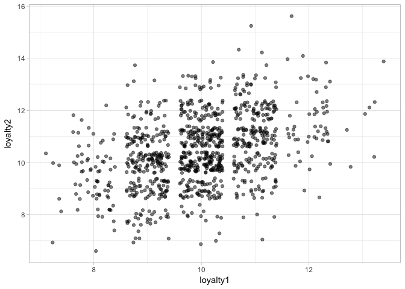
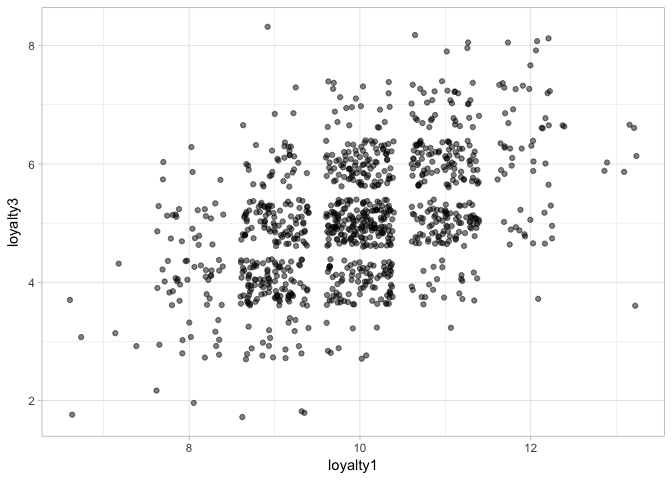
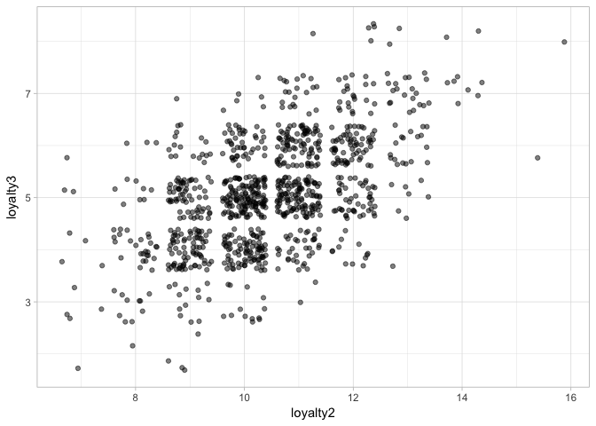
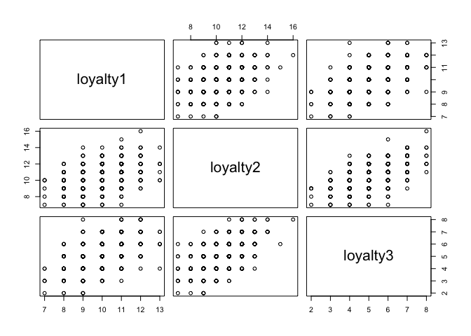

Module 3, Lab 2 - Association
=============================

In this lab, we will examine how to analyze data for a correlation. Note
that a detailed dive into correlational and regression-based research is
given in Module 5. However, a brief overview is provided here. I focus
on correlation because it is the simplest way to make an association
claim, but as we saw in the online lesson, actually the correct analysis
depends on your data (continuous, discrete, normal vs non-normal, etc.).
Thus, a full illustration of all association techniques would take many,
many labs. I focus on correlation here.

In this example, you are analyzing customer loyalty data. Your
organization uses three measures of loyalty, and you wish to test them
out. (To avoid discussions of popular real measures, we will name these
`loytalty1`, `loyalty2`, and `loyalty3`).

Note that this lab uses the `ggplot2` package for data visualization and
the `psych` package for correlation testing. I also assume you are
familiar with `ggplot2`. As an alternative to the `psych` tools, we can
also use the `Hmisc` package for correlation testing.

    #### LOAD PACKAGES ####
    library(psych)
    library(ggplot2)

    ## 
    ## Attaching package: 'ggplot2'

    ## The following objects are masked from 'package:psych':
    ## 
    ##     %+%, alpha

    library(Hmisc)

    ## Loading required package: lattice

    ## Loading required package: survival

    ## Loading required package: Formula

    ## 
    ## Attaching package: 'Hmisc'

    ## The following object is masked from 'package:psych':
    ## 
    ##     describe

    ## The following objects are masked from 'package:base':
    ## 
    ##     format.pval, round.POSIXt, trunc.POSIXt, units

You load the data from the CSV file in the github folder for this lab:

    #### LOAD DATA ####
    dat <- read.csv("loyaltydata.csv")

You inspect the data:

    names(dat)

    ## [1] "X"        "loyalty1" "loyalty2" "loyalty3"

    head(dat)

    ##   X loyalty1 loyalty2 loyalty3
    ## 1 1        9       10        4
    ## 2 2       10       11        5
    ## 3 3       10       10        5
    ## 4 4        9       10        5
    ## 5 5        8       11        4
    ## 6 6       10       12        5

There is an ID variable `X` and scores on a loyalty measures named
`loyalty1` through `loyalty3`. Note that you are not familiar with the
scaling of these measures.

The first thing to do is to explore the variables. The `summary()`
function has many useful features.

    summary(dat)

    ##        X             loyalty1        loyalty2        loyalty3    
    ##  Min.   :   1.0   Min.   : 7.00   Min.   : 7.00   Min.   :2.000  
    ##  1st Qu.: 250.8   1st Qu.: 9.00   1st Qu.:10.00   1st Qu.:4.000  
    ##  Median : 500.5   Median :10.00   Median :10.00   Median :5.000  
    ##  Mean   : 500.5   Mean   : 9.96   Mean   :10.45   Mean   :5.072  
    ##  3rd Qu.: 750.2   3rd Qu.:11.00   3rd Qu.:11.00   3rd Qu.:6.000  
    ##  Max.   :1000.0   Max.   :13.00   Max.   :16.00   Max.   :8.000

This gives you a sense as to the range and scaling of each loyalty
measure.

Imagine that each loyalty measure was in common use. You might want to
know whether they are highly correlated. We can compute correlations
between variables with `cor()`, removing the first variable (the ID
variable):

    cor(dat[,-1])

    ##           loyalty1  loyalty2  loyalty3
    ## loyalty1 1.0000000 0.3958527 0.4986953
    ## loyalty2 0.3958527 1.0000000 0.5737091
    ## loyalty3 0.4986953 0.5737091 1.0000000

This difficult to read. Let's `round()` this:

    round(cor(dat[,-1]), 2)

    ##          loyalty1 loyalty2 loyalty3
    ## loyalty1      1.0     0.40     0.50
    ## loyalty2      0.4     1.00     0.57
    ## loyalty3      0.5     0.57     1.00

We see here that the variables are *not* highly correlated with each
other. This is a potential problem.

A brief refresher: correlations range between zero (no association
between variables) and 1.0 (a one-to-one association). They can also be
positive (as one variable increases, so does the other) or negative (as
one variable increases, the other decreases).

The statistician Jacob Cohen suggested the following guidelines:

    ##   correlation    meaning
    ## 1   0.0 - 0.1 Negligible
    ## 2   0.1 - 0.3      Small
    ## 3   0.3 - 0.5     Medium
    ## 4      0.5 +       Large

However, given that they are all ostensibly measuring the same thing,
loyalty, we should expect much higher correlations (.7-.9).

We can also easily visualize this correlation with `ggplot2`. I will use
`geom_jitter()` to make the points more visible and make them partly
transparent by setting `alpha=.5`:

    ggplot(data=dat, aes(x=loyalty1, y=loyalty2))+
      geom_jitter(alpha=.5)+
      theme_light()

    ggplot(data=dat, aes(x=loyalty1, y=loyalty3))+
      geom_jitter(alpha=.5)+
      theme_light()

    ggplot(data=dat, aes(x=loyalty2, y=loyalty3))+
      geom_jitter(alpha=.5)+
      theme_light()

All of the graphs look about the same. It is always good to inspect the
plots, as we know that non-linearity can weaken our correlations. Here,
we see evidence that each measure is correlated linearly; the
associations are simply underwhelming.

Note that we can make a plot of these scatter plots as follows:

    plot(dat[,-1])

We can easily get *p*-values for these correlations (to determine if
they are statistically significant) using the `corr.test()` command in
the `psych` package:

    corr.test(dat[,-1])

    ## Call:corr.test(x = dat[, -1])
    ## Correlation matrix 
    ##          loyalty1 loyalty2 loyalty3
    ## loyalty1      1.0     0.40     0.50
    ## loyalty2      0.4     1.00     0.57
    ## loyalty3      0.5     0.57     1.00
    ## Sample Size 
    ## [1] 1000
    ## Probability values (Entries above the diagonal are adjusted for multiple tests.) 
    ##          loyalty1 loyalty2 loyalty3
    ## loyalty1        0        0        0
    ## loyalty2        0        0        0
    ## loyalty3        0        0        0
    ## 
    ##  To see confidence intervals of the correlations, print with the short=FALSE option

In this case, *p* values appear in the bottom matrix. In this case, all
results are significant.

You can also produce confidence intervals using the `rcorr()` function
from the `Hmisc` package. This accepts as an input, a `matrix` form of
your data.

    rcorr(as.matrix(dat[,-1]))

    ##          loyalty1 loyalty2 loyalty3
    ## loyalty1      1.0     0.40     0.50
    ## loyalty2      0.4     1.00     0.57
    ## loyalty3      0.5     0.57     1.00
    ## 
    ## n= 1000 
    ## 
    ## 
    ## P
    ##          loyalty1 loyalty2 loyalty3
    ## loyalty1           0        0      
    ## loyalty2  0                 0      
    ## loyalty3  0        0

Note that there are many ways of visualizing these associations. We will
explore the production of a full study using correlations later, in
Module 5.

#### cor.test()

If you want a 95% CI for any of these correlations, you can can use
`cor.test()` (this is from base R ... this is **not** `corr.test()` from
the `psych` package) on a pair of variables:

    cor.test(dat$loyalty1, dat$loyalty2)

    ## 
    ##  Pearson's product-moment correlation
    ## 
    ## data:  dat$loyalty1 and dat$loyalty2
    ## t = 13.618, df = 998, p-value < 2.2e-16
    ## alternative hypothesis: true correlation is not equal to 0
    ## 95 percent confidence interval:
    ##  0.3422587 0.4468793
    ## sample estimates:
    ##       cor 
    ## 0.3958527

Here, we see we are 95% confident that the correlation in the population
is between .34 and .45. We can save this and extract it if we want:

    cor1 <- cor.test(dat$loyalty1, dat$loyalty2)

There is a lot you can get in this analysis. Any time you save the
results from an analysis in R, try using `names()` to see what it
contains that you can extract:

    names(cor1)

    ## [1] "statistic"   "parameter"   "p.value"     "estimate"    "null.value" 
    ## [6] "alternative" "method"      "data.name"   "conf.int"

Each of these can be extracted with `$`. For example, we an extract the
CI with:

    cor1$conf.int

    ## [1] 0.3422587 0.4468793
    ## attr(,"conf.level")
    ## [1] 0.95

From here, we can even extract the individual levels with:

    cor1$conf.int[1]

    ## [1] 0.3422587

    cor1$conf.int[2]

    ## [1] 0.4468793

This is a very handy tool, because it means we can write code to grab
these values and use them (e.g., to make tables or plots as we desire).

One other handy feature of `cor.test()`: you can use an alternative form
of the correlation, "Spearman's correlation", if the data are too
non-normal. For example:

    cor.test(dat$loyalty1, dat$loyalty2, method="spearman")

    ## Warning in cor.test.default(dat$loyalty1, dat$loyalty2, method =
    ## "spearman"): Cannot compute exact p-value with ties

    ## 
    ##  Spearman's rank correlation rho
    ## 
    ## data:  dat$loyalty1 and dat$loyalty2
    ## S = 101590000, p-value < 2.2e-16
    ## alternative hypothesis: true rho is not equal to 0
    ## sample estimates:
    ##       rho 
    ## 0.3904435

We see it makes virtually no difference here, but if our data were too
skewed to use a standard correlation, this provides an acceptable backup
option for us.

What Claims Can We Make?
========================

Here, we can make the following claims: each of these variables is
correlated with each other, but in reality, the correlations are weaker
than you would hope them to be. In this case, we can have a series of
conversations about whether these measures of loyalty are assessing
different things, whether there are actually different kinds of customer
loyalty, or whether the measures are not of high quality. Regardless,
there appears to *not* be a large association between our measures of
loyalty. In fact, using 95% CIs, we found that we had fairly precise
estimate of our correlations: they are not strong. This raises large
implications for our organization as it considers using these measures.
