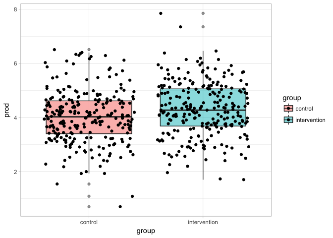
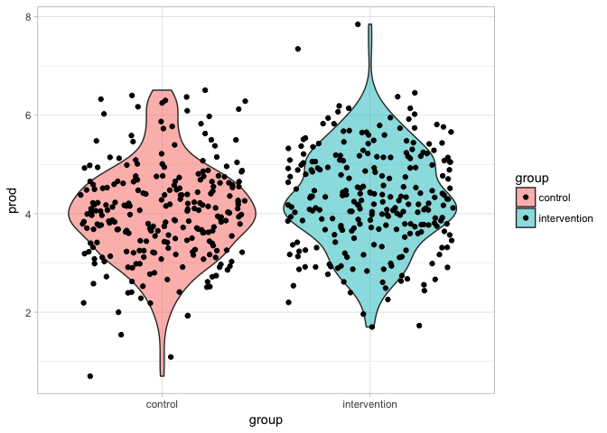
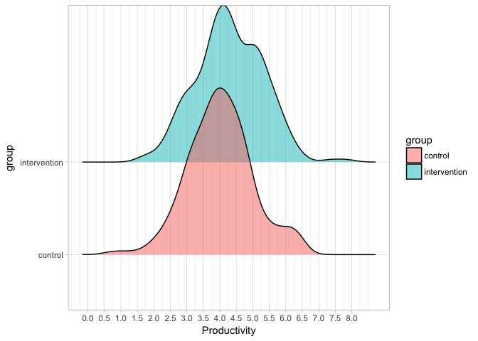

Module 3, Lab 3 - Causal Claims
===============================

In this lab, we briefly explore the causal claim. Recall that if you
want to truly understand your variables, you want to draw cause-effect
conclusions. Association claims are useful; they let you know what
variables correlate with each other.

In this lab, we will use the `effsize` package for measuring effect size
and the `ggplot2` package for data visualization. We will also briefly
explore the `ggridges` package.

    #### LOAD PACKAGES ####
    library(effsize)
    library(ggplot2)
    library(ggridges)

Weaknessess of Association Claims for Deep Understanding
========================================================

However, they don't tell you what will happen if you intervene and act
in the world in new ways. For example, imagine you have been analyzing
data at your organisation and find that employees who are less stressed
tend to be more productive. It may be very unclear *why* that
relationship exists. Some possibilities include:

1.  Stress reduces productivity
2.  Productivity reduces stress
3.  Some other variable is causing both of them

It is worth putting real thought into all of these.

1.  For example, it is reasonable that stress reduces productivity.
2.  However, it is also reasonable that getting things done may take
    stress off of the shoulders of employees as they clear projects off
    their to-do lists.
3.  It is also possible that something else may be casing both high
    stress and low productivity, such as obligations outside of work,
    health issues, etc.

All three of these have different implications for how to increase
productivity:

1.  The first possibility suggests that reducing stress might actually
    help.
2.  The second possibility suggests that reducing stress will not help
    (but finding other contributors to productivity might, so we should
    go looking for those). Time for more research!
3.  The third possibility suggests that attempts to reduce stress would
    do nothing to increase productivity because the real problem is the
    unmeasured *prior cause* of the stress. For example, if health
    issues are causing people to be more stressed and less productive,
    then the desired boost to productivity will not come from reducing
    stress but from fixing the underlying health issues.

In conclusion, association claims are limited in their ability to help
you draw cause-effect conclusions. Or, to put it differently, we could
*predict* the productivity of an employee given their stress levels, but
we wouldn't know how to actually *improve* productivity given this
information. Association claims simply don't really tell you what is
causing what.

Solution: The Experiment
========================

To solve this problem, we run an experiment. Imagine we randomly assign
250 employees to a stress-reduction treatment or a "business-as-usual"
control group. After 7 weeks, the productivity of these employees is
assessed.

Because employees are *randomly* assigned to groups *by the researhcer*,
the research can be confident that

-   The two groups were approximately equal to begin with (this can be
    checked, if desired)
-   Any differences at the end of the study are due to the treatment

We can draw this conclusion because we will be very careful to treat the
groups *identically* in every way, except for the treatment. We must be
**exceedingly** careful on this point, as any unintended differences in
treatment (the messaging we give them, the scheduling, workload, etc.)
could accidentally cause a second systematic difference between our
groups, and then we would not be sure what was really responsible for
any effects we end up seeing. This is known as a *coufound* and it would
run our experiment. We will be very sure not to allow this to happen,
using strict protocols, scripts, email templates, etc. We would be very
careful to manage expectations so neither group had different
expectations (possibly keeping our employees blind to some of the
details, or keeping managers in the dark). Our goal will be to keep
**everything the same between our groups**, tangibly and mentally,
except for the actual treatment itself. This will take very detailed and
rigorous planning, but it is worth it. A small-scale pilot of an
intervention program will take some rigorous planning, but it is much
less expensive than rolling out a company-wide stress program only to
find it is a waste of money and ineffective (as might happen in many
organizations).

Analyzing the Experiment
========================

To analyze the experiment, a simple independent-groups *t*-test can be
performed. This compares the means of the two groups to determine if
they are statistically significantly different.

Imagine the study is done; the data are called "causal.csv" and are in
the github folder for this lab.

    #### LOAD DATA ####
    dat <- read.csv("causal.csv")

    # Inspect data
    names(dat)

    ## [1] "X"     "group" "prod"

    str(dat)

    ## 'data.frame':    500 obs. of  3 variables:
    ##  $ X    : int  261 168 498 447 64 93 345 226 368 479 ...
    ##  $ group: Factor w/ 2 levels "control","intervention": 1 2 1 1 2 2 1 2 1 1 ...
    ##  $ prod : num  3.44 3.26 4.26 4.53 5.92 3.5 4.69 4.89 3.66 2.41 ...

    head(dat)

    ##     X        group prod
    ## 1 261      control 3.44
    ## 2 168 intervention 3.26
    ## 3 498      control 4.26
    ## 4 447      control 4.53
    ## 5  64 intervention 5.92
    ## 6  93 intervention 3.50

    summary(dat)

    ##        X                  group          prod      
    ##  Min.   :  1.0   control     :250   Min.   :0.700  
    ##  1st Qu.:125.8   intervention:250   1st Qu.:3.522  
    ##  Median :250.5                      Median :4.120  
    ##  Mean   :250.5                      Mean   :4.160  
    ##  3rd Qu.:375.2                      3rd Qu.:4.817  
    ##  Max.   :500.0                      Max.   :7.850

We see we have three variables, an id variable called `X`, a variable
listing the group, and the productivity scores of the employees on a 1-7
scale. We want to compare the two groups, and we can do so by looking at
the means.

We can quickly request more detailed statistics using `tapply()`. Recall
for `tapply()` accepts four arguments: the first is the variable to
analyze, the second is a factor (or list of factors) across which we
want to run the analysis, the third is the function we want to use in
the analysis, and the rest are arguments to pass along to our function.
In this case, we want means of `prod` across levels of `group`, with
missing values ignored:

    # Means
    tapply(dat$prod, dat$group, mean, na.rm=T)

    ##      control intervention 
    ##      4.01912      4.30104

    # SDs
    tapply(dat$prod, dat$group, sd, na.rm=T)

    ##      control intervention 
    ##    0.9850526    1.0096712

We see here that intervention group has a slightly higher average
productivity score. We can next test the null hypothesis to see if this
difference is significant.

Recall that the null hypothesis always says that the **effect is absent
in the population** and that the sample result is an artifact of random
chance. In symbols, this means that the difference between the group
averages is exactly zero in the population.

*H*0 : *μ**g**r**o**u**p*1 − *μ**g**r**o**u**p*2 = 0
 Remember that *μ* refers to the population average, so this is saying
that the population difference is exactly zero. Any difference observed
in our sample is therefore due to random chance. We run our *t*-test to
consider this possibility.

Recall that a *t*-test compares the size of the *observed difference*
($\\bar{x}\_{1}-\\bar{x}\_{2}$) against the value in the null hypothesis
(zero), divided by what is typically expected by chance:

$$t=\\frac{result - null }{chance}$$
 For the two-group *t*-test, the "result" is the difference between the
group averages in the sample, the "null" states the difference, and
"chance" is the standard error of that difference.

How can we run our test? The default in R is to run the "Welch" version
of the test. This version of the test does *not* make any assumptions
about the variances of the two groups.

$$t'=\\frac{result - null }{chance}=\\frac{(\\bar{x}\_{1}-\\bar{x}\_{2}) - 0 }{\\sqrt{\\frac{\\hat{\\sigma}\_1^2}{n\_{1}}+\\frac{\\hat{\\sigma}\_2^2}{n\_{2}}}}$$
 The bottom looks complicated but is simply a measure of the standard
error of the size of the difference between our two groups. We can
explore the details of this equation in a later lab. For now, let's run
the test and interpret the result.

The R code for the two-group *t*-test looks similar to the code for a
one-group *t*-test, used in the hypothesis-testing lab. Either of the
following work to test whether productivity differs as a function of
group:

    t.test(dat$prod ~ dat$group)

    ## 
    ##  Welch Two Sample t-test
    ## 
    ## data:  dat$prod by dat$group
    ## t = -3.1601, df = 497.7, p-value = 0.001673
    ## alternative hypothesis: true difference in means is not equal to 0
    ## 95 percent confidence interval:
    ##  -0.4572016 -0.1066384
    ## sample estimates:
    ##      mean in group control mean in group intervention 
    ##                    4.01912                    4.30104

    t.test(prod ~ group, data=dat)

    ## 
    ##  Welch Two Sample t-test
    ## 
    ## data:  prod by group
    ## t = -3.1601, df = 497.7, p-value = 0.001673
    ## alternative hypothesis: true difference in means is not equal to 0
    ## 95 percent confidence interval:
    ##  -0.4572016 -0.1066384
    ## sample estimates:
    ##      mean in group control mean in group intervention 
    ##                    4.01912                    4.30104

The *t*-value of 3.16 tells us that the difference between our groups
(top of *t*-test fraction) is 3.16 times larger than would be expected
typically by chance (bottom of *t*-test fraction). How often would a
result this big happen if the null were actually true? The *p*-value is
.002, so only 0.2% of the time. This is sufficient to reject the null
(*p* &lt; .05), and we can conclude that our difference is not due to
chance. We also have a 95% CI on the size of the difference, and we are
fairly confident that the control group is .457 to 0.107 productivity
points lower than intervention group.

Importantly, because we performed a randomized, controlled experiment,
we can conclude that this was actually the result of our treatment. This
is a good sign, but the size of the improvement is small. We can
conclude that our intervention **did** improve productivity, but it was
only by about a quarter of a point.

How big is that? Well, the scale is a 1-7 scale. We can try plotting the
data using a boxplot of the two groups to visualize it:

    ggplot(data=dat, aes(x=group, y=prod, fill=group))+
      geom_boxplot(alpha=.5)+
      geom_jitter(width=.40)+
      theme_light()

A violin plot might also help to visualize the differences:

    ggplot(data=dat, aes(x=group, y=prod, fill=group))+
      geom_violin(alpha=.5)+
      geom_jitter(width=.40)+
      theme_light()

We could also draw them as histograms using the `ggridges` package. Note
that there are many `gg`-style packages with canned visuals just waiting
for users to try them out. This one is handy for viewing the
distributions of multiple groups:

    ggplot(data=dat, aes(x=prod, y=group, fill=group))+
      geom_density_ridges(color="black", alpha=.5)+
      theme_light()+
      scale_x_continuous(name="Productivity", breaks=seq(from=0, to=8, by=.5))

    ## Picking joint bandwidth of 0.286

We see that, although the effect was statistically significant, the
difference is fairly minimal.

We can estimate our effect size (Cohen's *d*) using the `cohen.d`
command from the `effsize` package, which conveniently uses the same
arguments as `t.test()`:

    cohen.d(prod ~ group, data=dat)

    ## 
    ## Cohen's d
    ## 
    ## d estimate: -0.2826442 (small)
    ## 95 percent confidence interval:
    ##        inf        sup 
    ## -0.4592510 -0.1060373

This not only tells us that our sample effect size is small, but it puts
a 95% confidence interval around it as well. We are 95% confident the
true effect size is somewhere between small and very small.

Conclusion
==========

Thanks to this study, we can be fairly certain that the stress reduction
intervention had an effect. However, the difference in the effect is
minimal at best.
